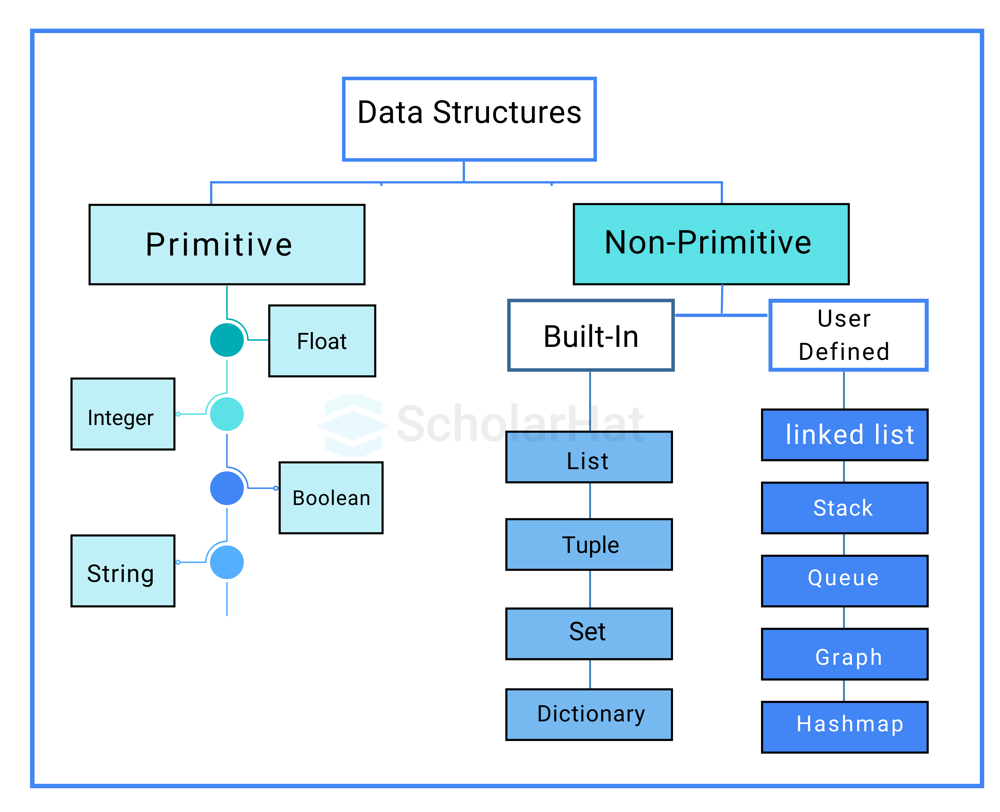

# Architectural Data Structure Specifications

## Abstract Data Types (ADT) Operational Matrix

The following matrix establishes the theoretical boundaries of standard Abstract Data Types, explicitly defining their core mechanical characteristics and mapping them to production Python infrastructure.

| Abstract Data Type | Defining Mechanical Characteristic                                                        | Behavioral Specification & Operational Use                                                                | Algorithmic Guardrails                                               | Python Tooling & Constraints                                                                                                                 |
| ------------------ | ----------------------------------------------------------------------------------------- | --------------------------------------------------------------------------------------------------------- | -------------------------------------------------------------------- | -------------------------------------------------------------------------------------------------------------------------------------------- |
| **Array**          | Contiguous memory allocation enabling instant physical offset calculation.                | Sequential storage. Hardware-cached sequential iteration, matrix computations.                            | $O(1)$ random access indexing via memory offset.                     | `list` (Dynamic). Python utilizes an array of contiguous `PyObject*` pointers; actual payload objects remain fragmented on the heap.         |
| **Linked List**    | Discontiguous memory nodes connected explicitly via embedded reference pointers.          | Sequential traversal. High-velocity arbitrary positional insertions without shifting subsequent elements. | $O(n)$ indexing and traversal. $O(1)$ terminal insertion.            | N/A. Architecture relies on `collections.deque` for terminal operations; physical fragmentation heavily degrades CPU cache utilization.      |
| **Stack**          | Memory mutation restricted entirely to a single contiguous boundary (Top).                | LIFO execution. Depth-First Search (DFS), algorithmic state backtracking.                                 | $O(1)$ terminal push and pop operations.                             | `list`. Architecture strictly confines operations to `append()` and `pop()` at the terminal index to guarantee amortized constant execution. |
| **Queue**          | Bipartite memory mutation separating insertion (Rear) and extraction (Front) boundaries.  | FIFO execution. Task scheduling, Breadth-First Search (BFS) state management.                             | $O(1)$ enqueue and dequeue operations.                               | `collections.deque`. Architecture forbids standard `list` utilization; `list.pop(0)` triggers a mandatory $O(n)$ spatial block shift.        |
| **Priority Queue** | Value-weighted tree structuring enforcing partial ordering invariant.                     | Deterministic extraction of minimum/maximum values. Dijkstra's algorithm, resource scheduling.            | $O(\log n)$ algorithmic node insertion and state extraction.         | `heapq`. Modifies underlying dynamic array in-place.                                                                                         |
| **Hash Table**     | Deterministic key-to-integer algorithmic transformation for immediate array indexing.     | Cryptographic key-value mapping. System caching mechanisms, high-speed discrete lookups.                  | Amortized $O(1)$ temporal lookup, insertion, and deletion.           | `dict`. High internal load factors trigger mandatory complete table rebuilds, causing severe temporary latency spikes.                       |
| **Set**            | Algorithmic collision resolution enforcing strict data uniqueness without payload values. | Unique element mathematical collection. Uniqueness verification, high-speed data deduplication.           | Amortized $O(1)$ deterministic membership verification.              | `set`. Operational constraints mandate absolute architectural immutability and hashability for all input elements.                           |
| **Graph**          | Multi-relational pointer webs defining interconnected vertex-to-edge pathways.            | Vertex and edge traversal mapping. Network topology modeling, relational pathfinding.                     | Scales linearly relative to discrete vertex/edge density ($O(V+E)$). | `dict` mapping to `list` or `set` (Adjacency List). Dense architectural branching factors consume excessive spatial memory overhead.         |

---

## Python Internal Implementation Matrix

The following matrix defines the physical C-level infrastructure underpinning Python's high-level objects, isolating their structural behaviors, execution limits, and failure modes.

| Python Object | C-Level Architecture         | Defining Structural Characteristic                                                                                | Complexity Guardrails                                             | Primary Bottleneck / Failure Mode                                                                                             | Theoretical ADT Mapping              |
| ------------- | ---------------------------- | ----------------------------------------------------------------------------------------------------------------- | ----------------------------------------------------------------- | ----------------------------------------------------------------------------------------------------------------------------- | ------------------------------------ |
| **`list`**    | Dynamic Array of Pointers    | Allocates a contiguous block of memory addresses pointing to scattered heap objects.                              | $O(1)$ index/append; $O(n)$ index 0 insertion or unsorted search. | Sub-linear capacity exhaustion forces mandatory $O(n)$ spatial buffer reallocation and total memory duplication.              | Array, Stack                         |
| **`dict`**    | Hash Table                   | Utilizes cryptographic hashes modulo array capacity to map keys to payload values.                                | Amortized $O(1)$ spatial mapping operations.                      | Hash collisions degrade execution to $O(n)$; baseline spatial memory overhead vastly exceeds sequential data structures.      | Hash Table, Graph (Adjacency List)   |
| **`set`**     | Hash Table (Keys Only)       | Discards value mapping entirely to optimize spatial overhead for uniqueness validation.                           | Amortized $O(1)$ element add/remove/contains execution.           | Injection of unhashable mutable types (e.g., nested lists) immediately triggers a fatal execution `TypeError`.                | Set                                  |
| **`tuple`**   | Fixed-Size Array of Pointers | Hardcodes memory allocation boundaries strictly at instantiation.                                                 | $O(1)$ discrete index access execution.                           | Absolute structural immutability prohibits in-place modification; updates mandate complete object destruction and recreation. | Static Array, Immutable Record       |
| **`deque`**   | Block-Linked Deque           | Chains discrete contiguous memory blocks (typically 64 bytes) via doubly-linked node pointers.                    | $O(1)$ terminal append/pop at both operational ends.              | Cross-block random index access initiates a mandatory $O(n)$ sequential traversal latency penalty.                            | Queue, Deque, Linked List (Terminal) |
| **`heapq`**   | Binary Min-Heap Utility      | Executes in-place mathematical index-shifting to enforce a complete binary tree structure within a standard list. | $O(\log n)$ tree-level push/pop spatial restructuring.            | Utility lacks object encapsulation; manual array mutation bypasses the algorithm and instantly corrupts the heap invariant.   | Priority Queue, Heap                 |
