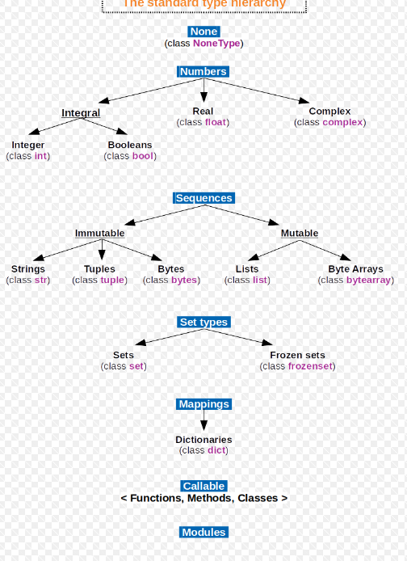

# Python Data Types: Architectural Mechanics & Memory Lifecycle

## Type System Primitives & Signatures

| Type Signature  | Architectural Mechanic       | Structural Definition                                                                                                                  | Operational System Constraint                                                                                            |
| --------------- | ---------------------------- | -------------------------------------------------------------------------------------------------------------------------------------- | ------------------------------------------------------------------------------------------------------------------------ |
| **`int`**       | Arbitrary-Precision Integer  | Variable-length C-array of 30-bit digits representing numeric values.                                                                  | Execution spatial limits correlate linearly with available system RAM; structural size scales automatically.             |
| **`float`**     | IEEE 754 Double-Precision    | 64-bit floating-point numeric representation implemented via C-level `double`.                                                         | Hardware-level mathematical precision degrades inherently at extreme operational magnitudes (floating-point arithmetic). |
| **`complex`**   | Bipartite Floating-Point     | Pairing of two 64-bit floats representing distinct real and imaginary mathematical components.                                         | Necessitates specialized arithmetic resolution paths; incompatible with standard integer bitwise operations.             |
| **`bool`**      | Subclassed Integer Singleton | Immutable strict subclass of `int` locked exclusively to memory addresses for `1` (`True`) or `0` (`False`).                           | Truth-value testing delegates to the underlying integer representation for performance optimization.                     |
| **`str`**       | Immutable Unicode Sequence   | Sequential array of Unicode code points optimizing spatial memory dynamically based on character magnitude (Latin-1, UCS-2, or UCS-4). | Absolute architectural immutability prohibits in-place mutation; transformations force complete memory duplication.      |
| **`bytes`**     | Immutable Byte Sequence      | Fixed sequential array representing raw 8-bit unsigned integers (0-255).                                                               | Cryptographic and network payload standard; mandates explicit explicit decoding/encoding layers for text resolution.     |
| **`bytearray`** | Mutable Byte Sequence        | Dynamic array representing contiguous raw 8-bit integers.                                                                              | Bypasses `bytes` memory reallocation penalties during high-velocity cryptographic or I/O buffer mutation.                |
| **`NoneType`**  | Null Pointer Singleton       | A singular, universally referenced memory address representing structural absence.                                                     | Verification mandates memory address identity checks (`is None`) rather than object value equivalence.                   |

## Architectural Typing Lexicon

| System Concept     | Operational Definition                                                                                         | Infrastructural Impact                                                                                                  |
| ------------------ | -------------------------------------------------------------------------------------------------------------- | ----------------------------------------------------------------------------------------------------------------------- |
| **`PyObject`**     | The foundational C-struct wrapping all data instances; strictly mandates a reference count and a type pointer. | Enforces a minimum structural memory baseline (typically 28 bytes on 64-bit hardware) regardless of payload size.       |
| **Strong Typing**  | The architectural prohibition of implicit type coercion during operation evaluation.                           | Prevents silent data degradation; invalid multi-type operations raise immediate runtime execution errors.               |
| **Dynamic Typing** | The resolution of type evaluation exclusively at runtime upon memory address traversal.                        | Eliminates static compilation overhead but mandates operational type checking overhead at every execution step.         |
| **Duck Typing**    | Structural execution priority favoring object behavior (methods/properties) over strict inheritance lineage.   | Enables decoupled polymorphism; delegates validation to runtime `AttributeError` manifestations.                        |
| **Immutability**   | Hardware-level lock preventing spatial mutation of an allocated `PyObject` payload post-instantiation.         | Ensures thread-safety and guarantees deterministic cryptographic hash values required for `dict` and `set` utilization. |
